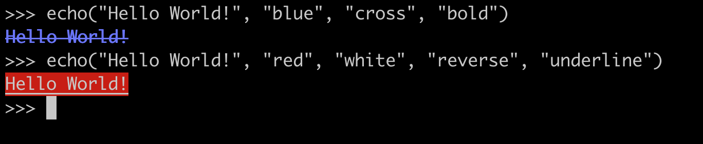
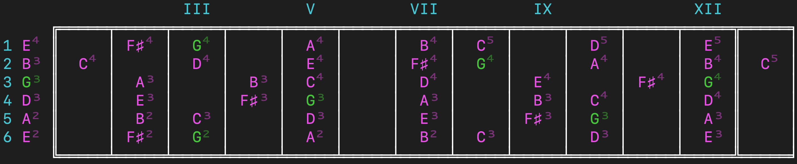
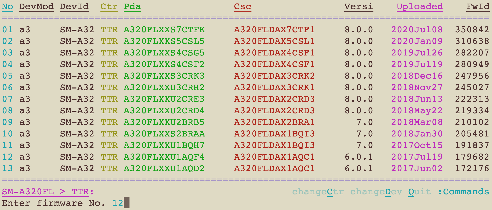
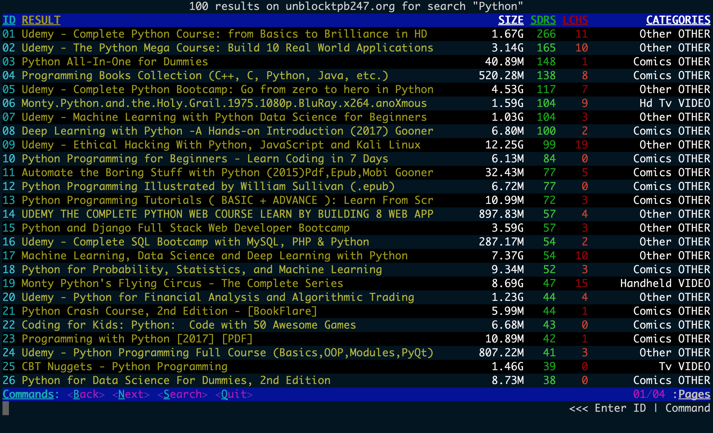

# bestia
bestia is a library of functions and classes designed to help you build command-line applications on Linux / Darwin systems that dinamically change along with the size of your terminal.


## available functions / classes

### output.py

```
* echo
* FString
* Row
* tty_rows
* tty_cols
* clear_screen
* expand_seconds
* remove_path
* obfuscate_random_chars
* ProgressBar
```

### iterate.py

```
* LoopedList
* items_are_equal
* iterable_to_string
* unique_random_items
* pop_random_item
```

### proc.py

```
* Process
```


## dependencies
Installing bestia does not require you to install any external dependencies.


## api reference

The highlight of this library is the output module and more specifically the _echo()_ function along with the *FString()* and _Row()_ classes. Let's have a quick look at how these work:

`>>> from bestia.output import echo, FString, Row `


### echo() function:

This is a very basic function which takes your string as first argument, followed by any number of effects that you may want to apply to your text. You can specify up to a maximum of 2 colors (1st: foreground, 2nd: background) and you can even use 'reverse' to switch between them.




Supported `fg` and `bg` values:  
`'black' 'red' 'green' 'yellow' 'blue' 'magenta' 'cyan' 'white'`  


Supported `fx` values:  
`'reset' 'bold' 'faint' 'underline' 'blink' 'reverse' 'conceal' 'cross' 'frame' 'circle' 'overline'`  

Not all terminal emulators support the same colors or fx so some of these may not work depending on what you are using.

The echo function has an optional last keyword argument `mode` that alters how strings are rendered|terminated. 

Supported `mode` values:  
`"modern", "raw", "retro"`  

Play with them and see what you like!


### FString() class:

The FString class was designed to help constructing strings that need to fit into specific areas of the terminal. This is done by dinamically preppending/appending blank spaces to the actual string so that it will be placed as needed on the horizontal plane. Let's take a look at a couple of examples:

```
>>> fs = FString('123', size=5, align='r')
>>> fs.echo()
  123
```

Notice how the "123" string has moved to the right by setting it's `size=5` and `align='r'`. The default value for align is `'l'`, but we can also use any of: `'l', 'r', 'c', 'cl', 'cr'`

```
>>> FString(' bla ', size=20, align='cl').echo()
        bla         
```

When dealing with empty spaces it can be hard to understand where our FStrings end and where the rest of the terminal begins. We can use the `pad` argument to help debug this or to create more interesting TUI's:

```
>>> FString(' asd ', size=20, align='cl', pad='|').echo()
||||||| asd ||||||||

>>> FString(' asd ', size=20, align='cr', pad='*').echo()
******** asd *******
```

On top of that, FString supports all the ANSI SGR Codes that echo() does thru the `fg=str, bg=str, fx=[]` arguments


### Row() class:

A Row() object is a string that's width is exactly one entire row of your current terminal size. It accepts any number of str|FString objects as arguments and will automatically resize them so that they occupy exactly 1 row.

```
>>> r = Row('123', FString('ABC', align='r'))
>>> r.echo()
123                                                                                                               ABC
```

You will often need the strings within your Row not to be resized (static size). In order to achieve this use a FString and specify the `size` attribute to what you want it to be. 


Unfortunately MarkDown is not great at showing off the possibilites that the library gives you in terms of creating vibrant looking CLI tools so in the next section I will let you take a look at a couple of applications built using bestia.

Enjoy!


## screenshots








